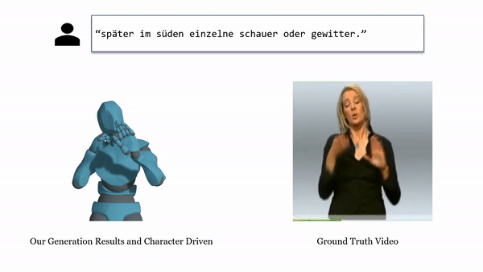
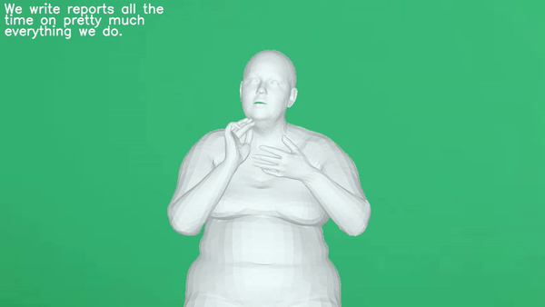
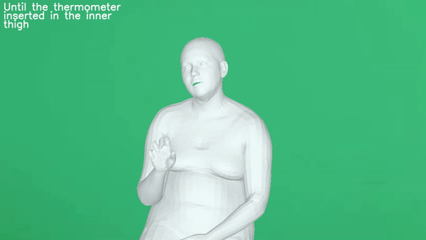

<p align="center">

  <h1 align="center">SignAvatars: A Large-scale 3D Sign Language Holistic Motion Dataset and Benchmark</h1>
  <p align="center">
    <a href="https://github.com/ZhengdiYu"><strong>Zhengdi Yu</strong></a><sup>1,2</sup>
    ·
    <a href="https://scholar.google.com/citations?user=o31BPFsAAAAJ&hl=en&oi=ao"><strong>Shaoli Huang</strong></a><sup>2</sup>
    ·
    <a href="https://github.com/cyk990422"><strong>Yongkang Cheng</strong></a><sup>2</sup>
    ·
    <a href="https://tolgabirdal.github.io/"><strong>Tolga Birdal</strong></a><sup>1</sup>
  </p>
  <p align="center">
    <strong><sup>1</sup>Imperial College London</strong></a>, <strong><sup>2</sup>Tencent AI Lab</strong></a>
  </p>
  <p align="center">
    <strong>ECCV 2024</strong></a>
  </p>
<!--   <h2 align="center">ICLR 2024</h2> -->
  <div align="center">
    
  </div>

  <p align="center">
    <a href='https://arxiv.org/abs/2310.20436'>
      
    </a>
    <a href='https://arxiv.org/pdf/2310.20436.pdf'>
      
    </a>
    <a href='https://signavatars.github.io/'>
    </a>
    <a href='https://youtu.be/GvIjKpgWfxI'>
    </a>
    <a href='https://github.com/ZhengdiYu/SignAvatars'>
      </a>
    <a href="" target='_blank'>
      
    </a>
  </p>
</p>

<br/>

**SignAvatars** is the first large-scale 3D sign language holistic motion dataset with mesh annotations, which comprises 8.34M precise 3D whole-body SMPL-X annotations, covering 70K motion sequences. The corresponding MANO hand version is also provided.
<br/>

## News :triangular_flag_on_post:
- [2024/12/4] [Paper] Visualization code is now provided. ⭐
- [2023/11/2] [Paper](https://arxiv.org/abs/2310.20436) is now available. ⭐

## TODO
- [x] Initial release of annotations.
- [x] Release the visualization code.
- [ ] Enrich the dataset

## Application examples on SLP
|                                                            |                                                                                                 |
| :--------------------------------------------------------------------------------: | :-----------------------------------------------------------------------------------------------------------------------: |
| SLP from HamNoSys |                                         SLP from Word                                          |
|                                                 |                                                                                        |
|        SLP from ASL | SLP from GSL |

##  Instruction 📜
### Dataset description
<p align="center"> <a href="https://youtu.be/GvIjKpgWfxI"></a> </p>

### Dataset download
For annotations, please fill out [this form](https://docs.google.com/forms/d/e/1FAIpQLSc6xQJJMf_R4xJ1sIwDL6FBIYw4HbVVv_HUgCqeiguWX5XGPg/viewform) to request access to use SignAvatars for non-commercial research purposes. By submitting the form, you have read and agree to the terms of the Data license and you will receive an email and please download the motion and text labels from the provided downloading links.

We do not distribute the original RGB videos due to license. We provide high-quality 3D motion labels annotated by our team. For the original video download of the **4** subsets, please follow the instructions below:
1. For **ASL** subset, please download `Green Screen RGB clips` from [how2sign dataset](https://how2sign.github.io/#download) and put into `language2motion/`.
2. For **HamNoSys** subset, please download the original videos using the data.json from the downloaded `HamNoSys/data.json`.
3. For **GSL** subset, please follow the [official instruction](https://www-i6.informatik.rwth-aachen.de/~koller/RWTH-PHOENIX-2014-T/) to download and put into `language2motion/`.
4. For **Word** subset, please follow the [official instruction](https://dxli94.github.io/WLASL/) to download and put into `word2motion/`.

### Dataset Structure
After downloading the data, please construct the layout of `dataset/` as follows:
```
|-- dataset
|   |-- hamnosys2motion/  
|   |   |-- images/
|   |   |   |-- <video_name>/
|   |   |   |   |-- <frame_number.jpg>   [ starts from 000000.jpg ]
|   |   |-- videos/
|   |   |   |-- <video_name>/  [ ..... ]   
|   |   |-- annotations/
|   |   |   |-- <annotation_type>  [ SMPL-X, MANO, ...]
|   |   |   |   |-- <video_name.pkl>
|   |   |-- data.json  [Text annotations]
|   |   |-- split.pkl
|   |   |
|   |-- language2motion/  
|   |   |-- images/
|   |   |   |-- <video_name>/
|   |   |   |   |-- <frame_number.jpg>   [ starts from 000000.jpg ]
|   |   |-- videos/
|   |   |   |-- <video_name>/  [ ..... ]   
|   |   |-- annotations/
|   |   |   |-- <annotation_type>  [ SMPL-X, MANO, ...]
|   |   |   |   |-- <video_name.pkl>
|   |   |-- text/
|   |   |   |-- how2sign_train.csv   [Text annotations]
|   |   |   |-- how2sign_test.csv    [Text annotations]
|   |   |   |-- how2sign_val.csv     [Text annotations]
|   |   |   |-- PHOENIX-2014-T.train.corpus.csv     [Text annotations]
|   |   |   |-- PHOENIX-2014-T.test.corpus.csv     [Text annotations]
|   |   |
|   |-- word2motion/  
|   |   |-- images/
|   |   |   |-- <video_name>/
|   |   |   |   |-- <frame_number.jpg>   [ starts from 000000.jpg ]
|   |   |-- videos/
|   |   |   |-- <video_name>/  [ ..... ]   
|   |   |-- annotations/
|   |   |   |-- <annotation_type>  [ SMPL-X, MANO, ...]
|   |   |   |   |-- <video_name.pkl>
|   |   |-- text/
|   |   |   |-- WLASL_v0.3.json   [Text annotations]
|   |   |
|-- common
|   |-- utils
|   |   |-- human_model_files
|   |   |   |-- smpl
|   |   |   |   |-- SMPL_NEUTRAL.pkl
|   |   |   |   |-- SMPL_MALE.pkl
|   |   |   |   |-- SMPL_FEMALE.pkl
|   |   |   |-- smplx
|   |   |   |   |-- MANO_SMPLX_vertex_ids.pkl
|   |   |   |   |-- SMPL-X__FLAME_vertex_ids.npy
|   |   |   |   |-- SMPLX_NEUTRAL.pkl
|   |   |   |   |-- SMPLX_to_J14.pkl
|   |   |   |   |-- SMPLX_NEUTRAL.npz
|   |   |   |   |-- SMPLX_MALE.npz
|   |   |   |   |-- SMPLX_FEMALE.npz
|   |   |   |-- mano
|   |   |   |   |-- MANO_LEFT.pkl
|   |   |   |   |-- MANO_RIGHT.pkl
```
In `common/` folder, `human_model_files` contains `smpl`, `smplx`, `mano`, and `flame` 3D model files. Download the files from [[SMPL_NEUTRAL]](https://github.com/sampepose/smpl_models/raw/master/SMPL_NEUTRAL.pkl) [[SMPL_MALE.pkl and SMPL_FEMALE.pkl]](https://download.is.tue.mpg.de/download.php?domain=smpl&sfile=SMPL_python_v.1.0.0.zip) [[smplx]](https://smpl-x.is.tue.mpg.de/) [[SMPLX_to_J14.pkl]](https://download.is.tue.mpg.de/download.php?domain=expose&resume=1&sfile=expose_data.zip) [[mano]](https://psfiles.is.tuebingen.mpg.de/downloads/mano/mano_v1_2-zip). Alternatively, you can directly download our packed model files from [Dropbox](https://www.dropbox.com/scl/fi/4gqt1vpyf3lam4n36fl6y/human_model_files.zip?rlkey=e3h2v3t9kyh0hkge880hbwwtm&dl=0) and unzip to `human_model_files`.

## Data Description
#### SMPL-X Annotation
In each of the .pkl files, the keys are in the format:
```
width, height: (1,) (1,) the video width and height
focal: (num_frames, 2)
princpt: (num_frames, 2)
2d: (num_frames, 106, 3)
pred2d: (num_frames, 106, 3)
total_valid_index: (num_frames,)
left_valid: (num_frames,)
right_valid: (num_frames,)
bb2img_trans: (num_frames, 2, 3)
smplx: (num_frames, 182)
unsmooth_smplx: (num_frames, 169)
```
For motion generation and motion prior learning tasks, you should use the data in `smplx` for better stability, whilst `unsmooth_smplx` can be used for pose estimation tasks. Please refer to [code](https://github.com/ZhengdiYu/Sign-Language-Motion-Datasets/blob/main/fit_smplx/fit_how2sign_smooth.py) for more details. For example, you can extract smplx parameters as follow:
```
all_parameters = results_dict['smplx']
root_pose, body_pose, left_hand_pose, right_hand_pose, jaw_pose, shape, expression, cam_trans = \
all_parameters[:, :3], all_parameters[:, 3:66], all_parameters[:, 66:111], all_parameters[:, 111:156], \
all_parameters[:, 156:159], all_parameters[:, 159:169], all_parameters[:, 169:179], all_parameters[:, 179:182]

all_parameters = results_dict['unsmooth_smplx']
root_pose, body_pose, lhand_pose, rhand_pose, shape, cam_trans = \
all_parameters[:, :3], all_parameters[:, 3:66], all_parameters[:, 66:111], all_parameters[:, 111:156], \
all_parameters[:, 156:166], all_parameters[:, 166:169]
```
```
root_pose: (num_frames, 3)
body_pose: (num_frames, 63)
expression: (num_frames, 10)
jaw_pose: (num_frames, 3)
betas: (num_frames, 10)
left_hand_pose: (num_frames, 45)
right_hand_pose: (num_frames, 45)
```
Please note that the `transl` is set to `0` in these subsets as there is no root position change in the video.

### Text Annotations
#### HamNoSys2Motion
- The signers are standing and doing a single sign.
- Each video is annotated with hamnosys glyph and hamnosys text:
  - `"hamsymmlr,hamflathand,hamextfingero,hampalml"`
- The average length of the video is 60 frames with 24 fps
#### Language2Motion
- The signers are sitting and doing multiple signs.
- Each video is annotated with natural language translations:
  - `"So we're going to start again on this one."`
- The average length of the video is 162 frames with 24 fps
#### Word2Motion
- The signers are standing and doing a single sign.
- Each video is annotated with word-level English:
- The average length of the video is 57 frames with 24 fps

## Getting Started & Visualization
### Installation
Using the virtual environment by running:
```bash
conda create -n signavatars python==3.8.8  
conda activate signavatars
conda install -n signavatars pytorch==1.10.0 torchvision==0.11.1 cudatoolkit=10.2 -c pytorch
pip install -r requirements.txt
```

### Visualize SMPL-X Annotations with pyrender (No need to download videos)
Alternatively, youcan can visualize .pkl from our dataset.
```bash
python vis.py \
--pkl_file_path <path_to_pkl_folder/file> \
```
This will render the motion with its text annotation. Then, the results will be saved in `./render_results/`:
<p float="left">
  
  
</p>

<p float="left">
  
  
</p>

### Visualize SMPL-X Annotations Overlay on Raw Videos with pyrender
To visualize the motion overlay on the image, you need to first download the videos and run:
```bash
python vis.py \
--pkl_file_path <path_to_pkl_folder/file> \
--video_path <path_to_video_folder>
--overlay
```
Then, the results will be saved in `./render_results_overlay/` (default shape here):
<p float="left">
  
  
</p>
<p float="left">
  
  
</p>

## Citation
```bibtex
@inproceedings{yu2024signavatars,
  title={SignAvatars: A large-scale 3D sign language holistic motion dataset and benchmark},
  author={Yu, Zhengdi and Huang, Shaoli and Cheng, Yongkang and Birdal, Tolga},
  booktitle={European Conference on Computer Vision (ECCV)},
  pages={1--19},
  year={2024}
}
```

## Contact
For technical questions, please contact ZhengdiYu@hotmail.com or z.yu23@imperial.ac.uk. For license, please contact shaolihuang@tencent.com.
