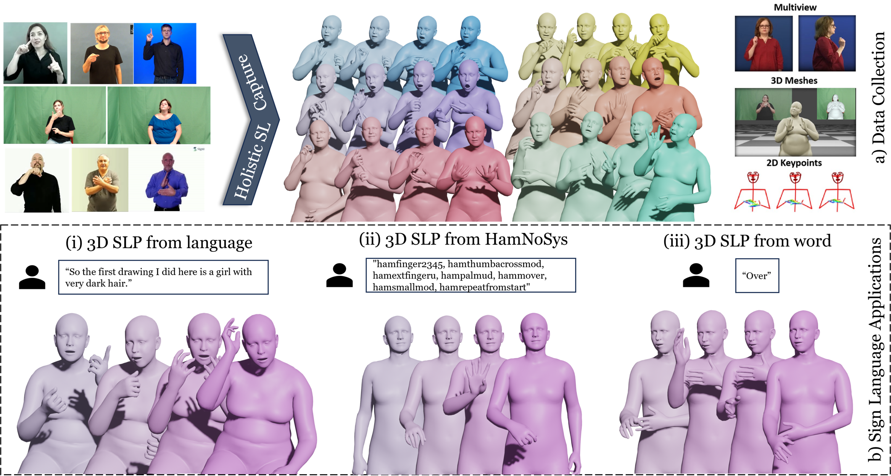
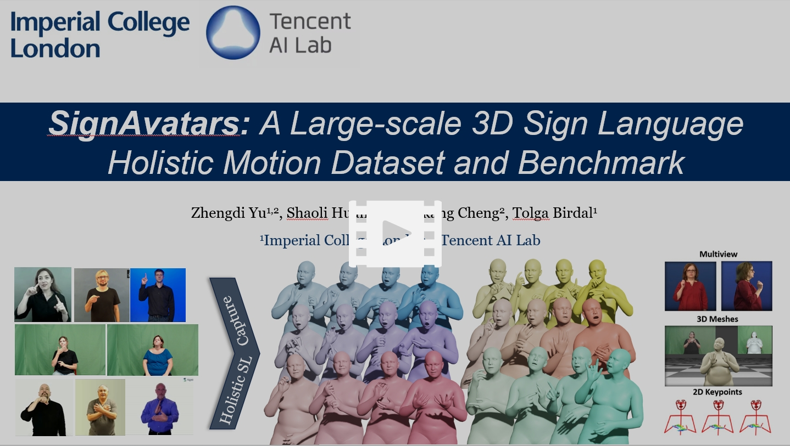

<p align="center">

  <h1 align="center">SignAvatars: A Large-scale 3D Sign Language Holistic Motion Dataset and Benchmark</h1>
  <p align="center">
    <a href="https://github.com/ZhengdiYu"><strong>Zhengdi Yu</strong></a><sup>1,2</sup>
    ·
    <a href="https://scholar.google.com/citations?user=o31BPFsAAAAJ&hl=en&oi=ao"><strong>Shaoli Huang</strong></a><sup>2</sup>
    ·
    <a href="https://github.com/cyk990422"><strong>Yongkang Cheng</strong></a><sup>2</sup>
    ·
    <a href="https://tolgabirdal.github.io/"><strong>Tolga Birdal</strong></a><sup>1</sup>
  </p>
  <p align="center">
    <strong><sup>1</sup>Imperial College London</strong></a>, <strong><sup>2</sup>Tencent AI Lab</strong></a>
  </p>
<!--   <h2 align="center">ICLR 2024</h2> -->
  <div align="center">
    
  </div>

  <p align="center">
    <a href='https://arxiv.org/abs/2310.20436'>
      
    </a>
    <a href='https://arxiv.org/pdf/2310.20436.pdf'>
      
    </a>
    <a href='https://signavatars.github.io/'>
    </a>
    <a href='https://youtu.be/'>
    </a>
    <a href='https://github.com/ZhengdiYu/SignAvatars'>
      </a>
    <a href="" target='_blank'>
      
    </a>
  </p>
</p>

<br/>

**SignAvatars** is the first large-scale 3D sign language holistic motion dataset with mesh annotations, which comprises 8.34M precise 3D whole-body SMPL-X annotations, covering 70K motion sequences. The corresponding MANO hand version is also provided.
<br/>

## News :triangular_flag_on_post:
- [2023/11/2] [Paper](https://arxiv.org/abs/2310.20436) is now available. ⭐

## Dataset description
<p align="center"> <a href="https://youtu.be/"></a> </p>

### Dataset download
Coming soon!

## Application examples on SLP
|                                                            |                                                                                                 |
| :--------------------------------------------------------------------------------: | :-----------------------------------------------------------------------------------------------------------------------: |
| SLP from HamNoSys |                                         SLP from Word                                          |
|                                                 |                                                                                        |
|        SLP from ASL | SLP from ASL |

## Instruction
Coming soon!

## Citation
```bibtex
@inproceedings{yu2023signavatars,
  title = {SignAvatars: A Large-scale 3D Sign Language Holistic Motion Dataset and Benchmark},
  author = {Yu, Zhengdi and Huang, Shaoli and Cheng, Yongkakng and Birdal, Tolga},
  journal = {arXiv preprint arXiv:2310.20436},
  month     = {November},
  year      = {2023}
  }
```

## Contact
For technical questions, please contact ZhengdiYu@hotmail.com

For commercial licensing, please contact shaolihuang@tencent.com
